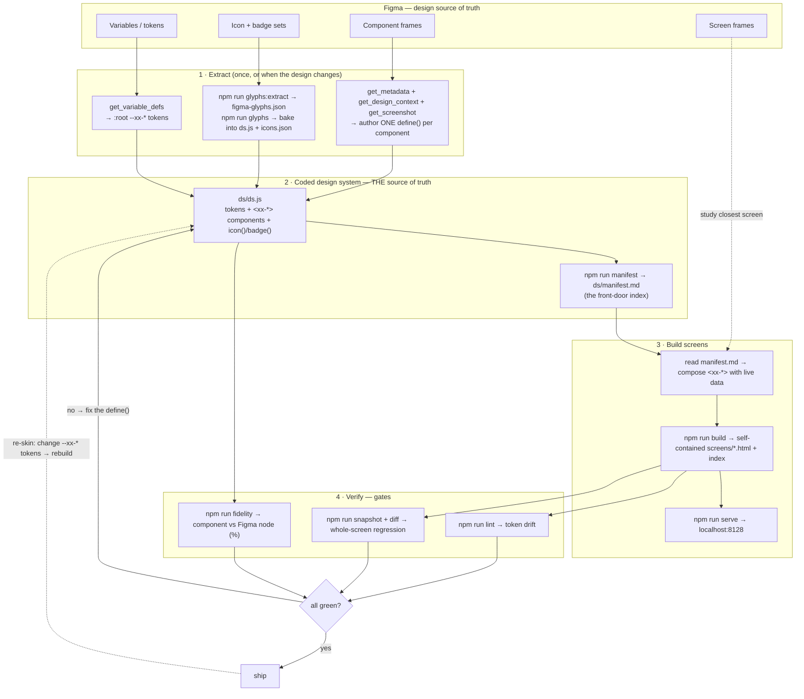
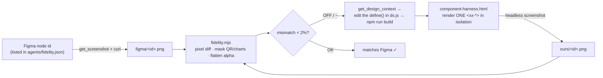

# PROCESS — how the whole design-system loop works

A product-agnostic map of the pipeline, so you can stand up a new coded design system for any
product. `xx-` / `--xx-*` are placeholders for your prefix (this starter uses `ds-` / `--ds-*`).

**One sentence:** Figma is the design source of truth → you *extract* tokens, glyphs, and component
specs into **one coded file** (`ds/ds.js`), which is THE source of truth → a generated manifest is
the model's front door → screens are composed from it and built self-contained → three gates verify
it (drift, per-component fidelity, screen regression) → re-skin by changing tokens.

> **What ships in this starter:** the coded DS, manifest, build, serve, and the **lint + fidelity +
> screen-regression** gates. The **glyph-import** step (`glyphs:extract` / `glyphs` in the diagram)
> is an optional add-on — the starter ships hand-authored `ds-icon`/`ds-badge` glyphs. When you want
> to import a real Figma icon set, port `pipeline/extract-figma-glyphs.mjs` + `bake-glyphs.mjs` from
> the reference implementation.

---

## Big picture



## The fidelity loop (the part you just added), zoomed in



---

## ASCII overview (for plain editors)

```
        FIGMA (design source of truth)
   tokens · glyph sets · component frames · screen frames
        │            │              │                 │
        ▼            ▼              ▼                 │ (reference)
 [get_variable]  [glyphs:extract] [get_metadata/                │
   _defs          → bake]          design_context/screenshot]   │
        │            │              │                            │
        └──────┬─────┴──────┬───────┘                            │
               ▼            ▼                                    │
        ╔══════════════════════════════════════╗                │
        ║  ds/ds.js   ← THE SOURCE OF TRUTH     ║                │
        ║  tokens + <xx-*> components + glyphs  ║                │
        ╚══════════════════════════════════════╝                │
               │ build-manifest                                  │
               ▼                                                 │
        ds/manifest.md  (front-door index) ◄─────────────────────┘
               │ compose <xx-*>
               ▼
        build-screens → self-contained screens/*.html + index
               │ serve → localhost:8128
               ▼
        ┌──────────── VERIFY (gates) ────────────┐
        │ lint (drift) · fidelity (vs node %) ·   │
        │ snapshot + diff (screen regression)     │
        └─────────────────┬───────────────────────┘
            green? ──no──► fix the define() (back to ds/ds.js)
              │yes
              ▼
            ship  ──re-skin: change --xx-* tokens, rebuild──► (back to ds/ds.js)
```

---

## Legend — each step → command → files

| Phase | What | Command | Key files |
|---|---|---|---|
| **Extract · tokens** | Pull Figma variables → CSS tokens | Figma MCP `get_variable_defs` | `ds/ds.js` `:root{ --xx-* }` |
| **Extract · glyphs** | Icon/badge sets → flattened SVG, baked in | `npm run glyphs:extract` then `npm run glyphs` | `pipeline/extract-figma-glyphs.mjs`, `pipeline/bake-glyphs.mjs`, `figma-glyphs.json`, `icons.json` |
| **Extract · components** | Per component: read node, author code | `get_metadata` + `get_design_context` + `get_screenshot` | one `define()` block in `ds/ds.js` |
| **Codify** | Generate the component index | `npm run manifest` | `ds/build-manifest.mjs` → `ds/manifest.md` |
| **Build screens** | Compose + inline DS, make self-contained | `npm run build` | `build-screens.mjs` → `screens/*.html`, `screens/index.html` |
| **Preview** | Serve gallery + screens | `npm run serve` | `serve.mjs` → `:8128/` and `/screens/` |
| **Gate · drift** | No hardcoded token-equal colors | `npm run lint` (`lint:fix`) | `agents/lint-ds.mjs` |
| **Gate · fidelity** | Each component vs its Figma node | `npm run fidelity` | `agents/fidelity.json`, `component-harness.html`, `agents/fidelity.mjs` |
| **Gate · regression** | Whole screens vs baselines / Figma | `npm run snapshot`, `npm run diff` | `agents/snapshot.mjs`, `agents/visual-diff.mjs` |
| **All gates** | The one command before "done" | `npm run verify` | manifest → build → lint |
| **Re-skin** | Whole product re-themes | edit `--xx-*` → `npm run build` | `ds/ds.js` `:root` |

---

## Starting a new product (the short version)

1. **Copy the machine.** `cp -R template my-new-app` (the `template/` here is the stripped, reusable
   starter — full machine + a tokens-only DS). See `template/BOOTSTRAP.md`.
2. **Point at the new Figma file**, set your prefix, paste the new `--xx-*` tokens.
3. **Run the loop above:** glyphs → components (fan out subagents, one `define()` each) → manifest
   → screens → `npm run verify` → `npm run fidelity` to gate against Figma.
4. **Re-skin / iterate** by changing tokens.

**The one rule that makes all of this work:** never hand-roll a component inside a screen — if it's
not in `manifest.md`, add it to `ds/ds.js` first. That's what keeps screens coherent and makes a
token-only re-skin theme the whole product at once.
